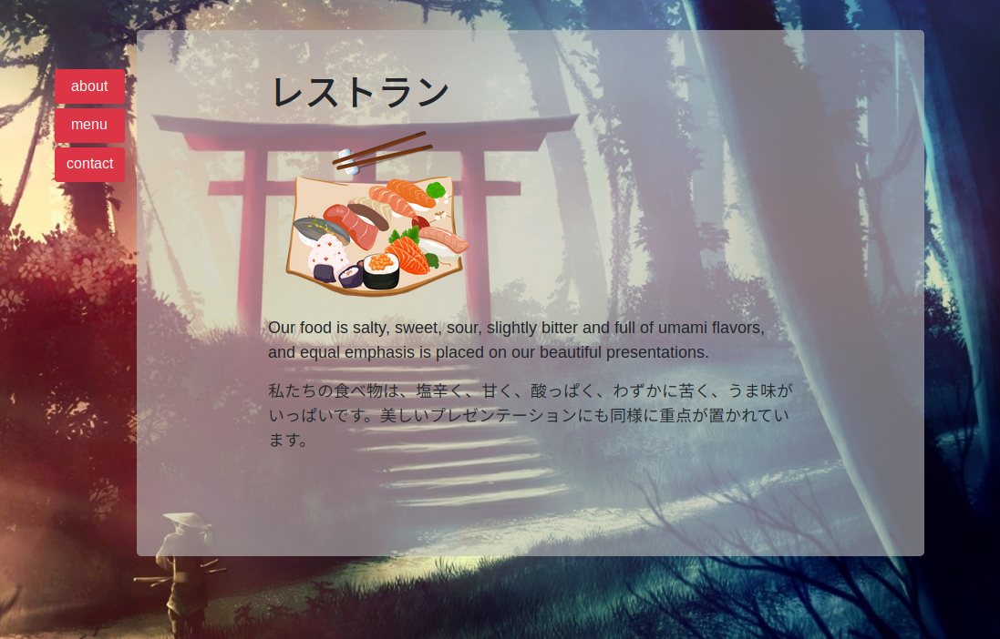

 

  

  <h3 align="center">Library</h3>

  

    JavaScript Project
     
     
    <a href="#">View Demo</a>
    ·
    <a href="https://github.com/samgaco/restaurantpage/issues">Report Bug</a>
    ·
    <a href="https://github.com/samgaco/restaurantpage/issues">Request Feature</a>
  

<!-- TABLE OF CONTENTS -->
## Table of Contents

* [About the Project](#about-the-project)
  * [Built With](#built-with)
* [Contact](#Contact)

<!-- ABOUT THE PROJECT -->
## About The Project

  

Based on the [ Restaurant page project](https://www.theodinproject.com/courses/javascript/lessons/restaurant-page) in the odin project as a part of the Microverse curriculum. The purpose was to have a first contact with the webpack system.

The project displays a restaurant page with a menu that renders content when clicked coming from different javascript modules. Webpack is used to bundle all the modules in one file minewhile event listeners are used to render the content and remove it once we click on another button, that way we gain speed and efficiency.

### Built With
* [JavaScript](https://www.javascript.com/)
* [Webpack](https://webpack.js.org/)

### Contact

* [Samuel García Companys](https://github.com/samgaco) - samuelgarciacompanys@gmail.com - [Linkedin](https://www.linkedin.com/in/samuel-garc%C3%ADa-companys-0a848284/)
